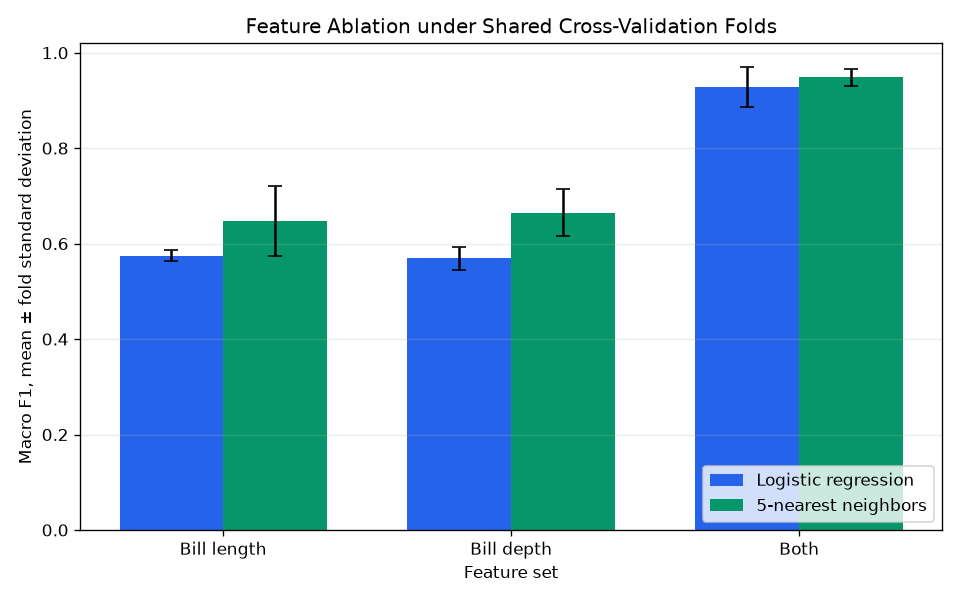

# Version 0.4 Evaluation Result

## Question

Do bill length and bill depth provide complementary signal under the existing
controlled classifier comparison, and do basic split-integrity and
shuffled-label diagnostics reveal an obvious leakage warning?

## Controlled Setup

- Dataset rows: 344
- Candidate features: `bill_length_mm`, `bill_depth_mm`
- Feature sets: bill length only, bill depth only, and both measurements
- Models: fixed logistic regression and 5-nearest neighbors
- Cross-validation: the same five shuffled stratified folds for every feature
  set, model, and diagnostic
- Preprocessing: median imputation and standardization fitted inside each
  training partition
- Selection policy: diagnostic only; no feature set or model is selected from
  these scores
- Negative control: training labels shuffled within each fold while validation
  labels remain unchanged
- Random state: 42; label-shuffle seed is 42 plus the one-based fold number

The majority-class dummy remains in the primary comparison but is excluded
from feature ablation because it does not use input features.

## Primary Comparison Reference

| Model | Accuracy, mean ± std | Balanced Accuracy, mean ± std | Macro F1, mean ± std |
| --- | ---: | ---: | ---: |
| Majority-class dummy | 0.441858 ± 0.006490 | 0.333333 ± 0.000000 | 0.204291 ± 0.002081 |
| Logistic regression | 0.944800 ± 0.033510 | 0.923659 ± 0.043207 | 0.928288 ± 0.041342 |
| 5-nearest neighbors | 0.959292 ± 0.010882 | 0.947829 ± 0.022578 | 0.949112 ± 0.017756 |

These two-feature scores are the reference for the ablation differences below.

## Feature Ablation

| Feature set | Model | Accuracy | Balanced Accuracy | Macro F1 |
| --- | --- | ---: | ---: | ---: |
| Bill length only | Logistic regression | 0.744288 ± 0.022538 | 0.622724 ± 0.011612 | 0.574987 ± 0.012112 |
| Bill length only | 5-nearest neighbors | 0.732822 ± 0.049770 | 0.653446 ± 0.061832 | 0.647485 ± 0.072626 |
| Bill depth only | Logistic regression | 0.755754 ± 0.031414 | 0.627516 ± 0.024334 | 0.568900 ± 0.024325 |
| Bill depth only | 5-nearest neighbors | 0.741176 ± 0.050273 | 0.664400 ± 0.042212 | 0.664812 ± 0.049604 |
| Both measurements | Logistic regression | 0.944800 ± 0.033510 | 0.923659 ± 0.043207 | 0.928288 ± 0.041342 |
| Both measurements | 5-nearest neighbors | 0.959292 ± 0.010882 | 0.947829 ± 0.022578 | 0.949112 ± 0.017756 |

The paired macro-F1 differences relative to both measurements are:

| Removed measurement | Logistic Difference | KNN Difference |
| --- | ---: | ---: |
| Bill depth | -0.353300 | -0.301627 |
| Bill length | -0.359387 | -0.284300 |

Both single-feature configurations are substantially below the two-feature
reference for both models. Under these fixed folds and configurations, bill
length and bill depth provide complementary predictive signal. The result does
not establish causal importance, measurement value outside this dataset, or
an optimal feature subset.



## Split-Integrity Diagnostics

All five folds satisfy the implemented structural checks:

- Maximum train/validation overlap: 0 rows
- Validation coverage minimum: 1
- Validation coverage maximum: 1
- Training plus validation rows per fold: 344
- Complete pipeline fit scope: training partition

These checks verify the row-index properties of this splitter output. They do
not inspect external provenance, repeated biological individuals, or hidden
relationships not represented by a row index.

## Shuffled-Training-Label Negative Control

| Model | Observed Macro F1 | Shuffled Macro F1 | Observed − Shuffled |
| --- | ---: | ---: | ---: |
| Logistic regression | 0.928288 | 0.253790 ± 0.052453 | 0.674498 |
| 5-nearest neighbors | 0.949112 | 0.297675 ± 0.053507 | 0.651437 |

The negative control destroys the association between features and training
labels inside each fold while preserving the training-label counts and leaving
validation labels unchanged. Both shuffled-label means are substantially below
the observed means, and the difference is positive in every fold.

This outcome is consistent with the primary scores depending on the intended
feature-label association. It is not proof that the project is free from every
form of leakage. A shuffled-label control can miss duplicated entities,
provenance leakage, time leakage, or a feature that directly encodes the target
in a way not exercised by this small dataset.

## Continuity Artifacts

The deterministic holdout, three-model comparison, fold-level scores,
row-level predictions, and logistic-regression confusion matrix from v0.3 are
retained and regenerated under report schema version 4.


## Interpretation Boundary

Version 0.4 adds diagnostic evidence, not a production leakage certification.
The ablation and negative control reuse one five-fold partition and one public
dataset revision. Their standard deviations describe observed fold variation
and are not confidence intervals.

The committed artifacts demonstrate a deterministic implementation of feature
ablation, split-integrity checks, and a negative control. They are not a
benchmark claim, causal feature-importance result, or ecological conclusion.

## Reproduction

From the repository root:

```bash
python examples/run_demo.py
python examples/run_demo.py --verify-only
```
