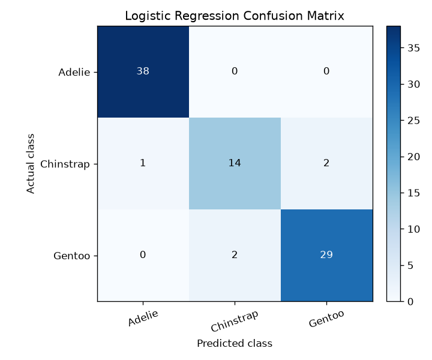
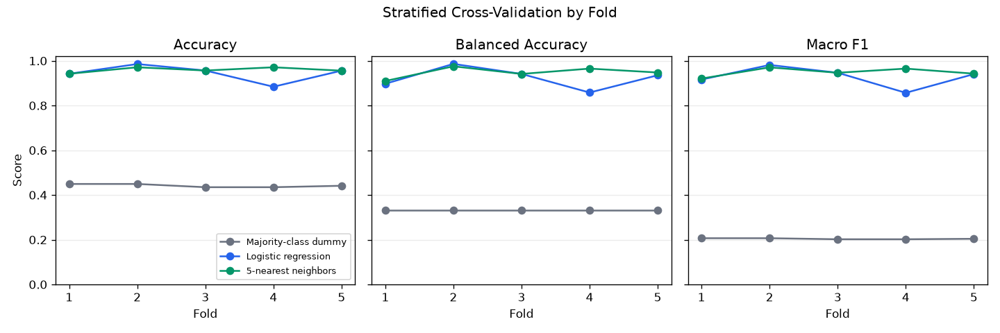

# Version 0.3 Evaluation Result

## Question

How does a fixed local nonlinear classifier compare with a linear baseline
when both use only bill length and bill depth to separate the three species in
the pinned Palmer Penguins dataset?

## Controlled Setup

- Dataset rows: 344
- Selected features: `bill_length_mm`, `bill_depth_mm`
- Missing selected feature cells: 4
- Holdout: stratified 75/25 split
- Cross-validation: five stratified folds with shuffling
- Random state: 42 for both evaluation paths
- Preprocessing: median imputation and standardization fitted inside each
  training partition
- Reference baseline: most-frequent `DummyClassifier`
- Linear baseline: `LogisticRegression(max_iter=1000, random_state=42)`
- Nonlinear comparator: `KNeighborsClassifier(n_neighbors=5,
  weights="uniform", algorithm="auto", leaf_size=30, metric="minkowski",
  p=2)`

All three models use the same feature rows, holdout partition, and
cross-validation folds. Every fold refits the complete preprocessing and
classifier pipeline. The KNN configuration is fixed in advance; no score in
this report is used for hyperparameter selection.

## Holdout Comparison

| Model | Accuracy | Balanced Accuracy | Macro F1 |
| --- | ---: | ---: | ---: |
| Majority-class dummy | 0.441860 | 0.333333 | 0.204301 |
| Logistic regression | 0.941860 | 0.919671 | 0.923661 |
| 5-nearest neighbors | 0.965116 | 0.958887 | 0.959670 |

KNN correctly classifies 83 of 86 holdout rows, compared with 81 for logistic
regression. Relative to logistic regression, its holdout differences are
+0.023256 accuracy, +0.039216 balanced accuracy, and +0.036009 macro F1.

KNN recall is 1.000000 for Adelie, 0.941176 for Chinstrap, and 0.935484 for
Gentoo. Its three errors are one Chinstrap predicted as Gentoo and two Gentoo
observations predicted as Adelie and Chinstrap. The row-level evidence is
available in `predictions.csv`.

The logistic-regression confusion matrix is retained for continuity with the
earlier baseline evaluation:



## Cross-Validation Comparison

The standard deviations below are population standard deviations across the
five observed fold scores.

| Model | Accuracy, mean ± std | Balanced Accuracy, mean ± std | Macro F1, mean ± std |
| --- | ---: | ---: | ---: |
| Majority-class dummy | 0.441858 ± 0.006490 | 0.333333 ± 0.000000 | 0.204291 ± 0.002081 |
| Logistic regression | 0.944800 ± 0.033510 | 0.923659 ± 0.043207 | 0.928288 ± 0.041342 |
| 5-nearest neighbors | 0.959292 ± 0.010882 | 0.947829 ± 0.022578 | 0.949112 ± 0.017756 |

KNN has a mean paired macro-F1 difference of +0.020824 relative to logistic
regression. The fold-level comparison shows why the mean alone is incomplete:

| Fold | Logistic Macro F1 | KNN Macro F1 | KNN − Logistic |
| ---: | ---: | ---: | ---: |
| 1 | 0.916157 | 0.920694 | +0.004537 |
| 2 | 0.981414 | 0.970661 | -0.010753 |
| 3 | 0.946570 | 0.946570 | 0.000000 |
| 4 | 0.856905 | 0.965079 | +0.108174 |
| 5 | 0.940392 | 0.942555 | +0.002163 |

KNN slightly trails logistic regression in fold 2, ties it in fold 3, and
shows its largest improvement in fold 4. Its macro-F1 standard deviation is
lower in these five folds, largely because it avoids the linear model's
fold-4 decline. This is observed stability under one partition, not proof that
KNN is inherently more stable.



## Interpretation Boundary

The controlled comparison shows that a fixed local nonlinear decision rule can
improve the mean score and reduce observed fold variation for this constrained
two-feature problem. It does not establish universal KNN superiority: the
linear model leads in one fold, the comparison contains only two substantive
models, and no independent test dataset is available.

The KNN parameters were not tuned, so this is not an optimization study. The
five training partitions overlap, so their scores are not independent. The
reported standard deviations describe observed fold variation and are not
confidence intervals.

The result remains specific to one dataset revision, one feature pair, one
holdout, one cross-validation partition, and the fixed configurations above.
It does not establish transfer to a new island, year, collection protocol, or
field setting.

The committed artifacts are functional evidence for a deterministic model
comparison, not a benchmark claim or an ecological conclusion.

## Reproduction

From the repository root:

```bash
python examples/run_demo.py
python examples/run_demo.py --verify-only
```
