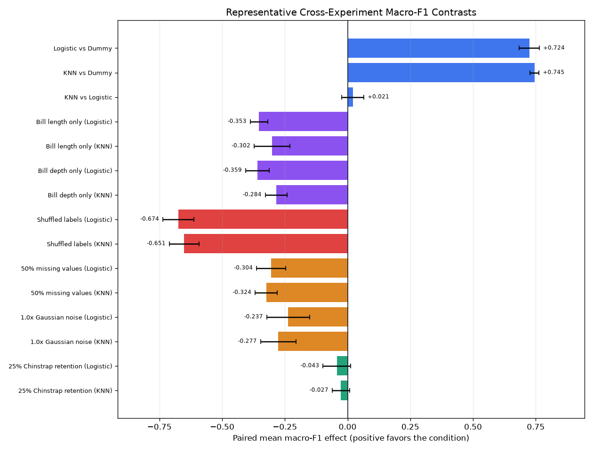
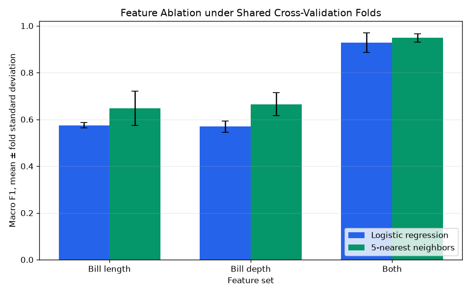
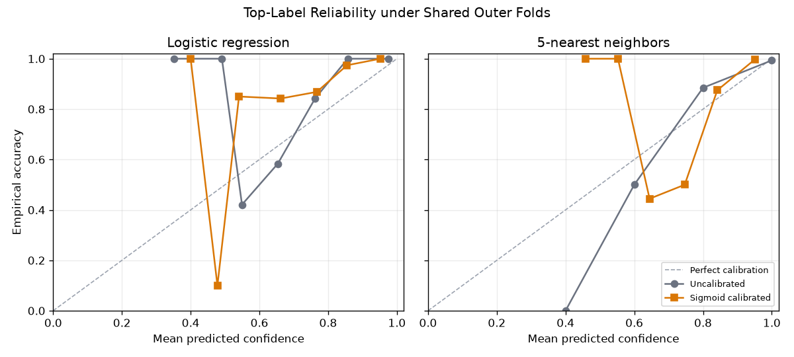
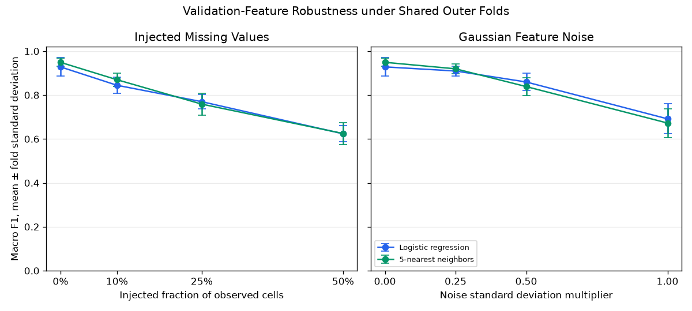
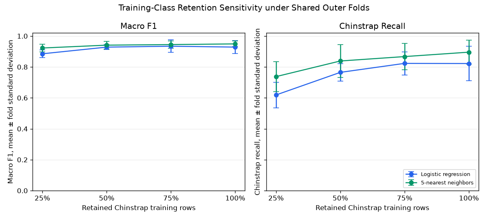
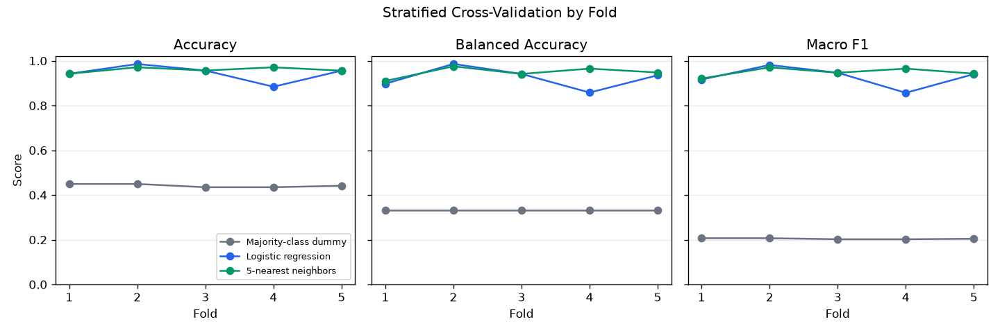
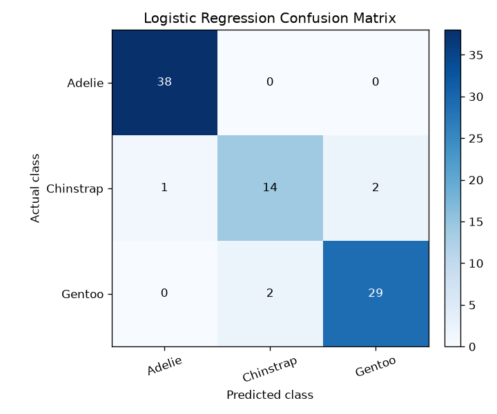

# Version 0.8 Evaluation Result

## Question

How can representative evidence from six controlled experiment families be
summarized without hiding paired fold variation, mixing metric direction, or
disconnecting the summary from its source artifacts? Which CLI, Python API,
report, and artifact interfaces does this release expose?

## Controlled Setup

- Dataset rows: 344
- Candidate features: `bill_length_mm`, `bill_depth_mm`
- Feature sets: bill length only, bill depth only, and both measurements
- Models: fixed logistic regression and 5-nearest neighbors
- Cross-validation: the same five shuffled stratified folds for every feature
  set, model, and diagnostic
- Preprocessing: median imputation and standardization fitted inside each
  training partition
- Selection policy: diagnostic only; no feature set or model is selected from
  these scores
- Negative control: training labels shuffled within each fold while validation
  labels remain unchanged
- Probability methods: uncalibrated and sigmoid calibrated
- Calibration: three stratified inner folds drawn only from each outer
  training partition
- Probability metrics: multiclass log loss, multiclass Brier score, and
  ten-bin top-label expected calibration error
- Missing-value rates: 0%, 10%, 25%, and 50% of observed validation feature
  cells, selected without replacement
- Gaussian-noise levels: 0, 0.25, 0.5, and 1.0 times each outer training
  fold's population standard deviation per feature
- Perturbation scope: validation features only; training data and validation
  labels remain unchanged
- Class-imbalance target: Chinstrap, the globally least frequent class
- Training-class retention: 100%, 75%, 50%, and 25%, sampled without
  replacement inside each outer training fold
- Class-imbalance scope: target-class training rows only; validation data and
  labels remain unchanged
- Cross-experiment selection: fixed representative contrasts across model
  comparison, feature ablation, shuffled-label control, probability
  calibration, validation robustness, and class imbalance
- Difference definition: condition minus reference within each outer fold
- Preferred-effect definition: the paired difference is sign-aligned so a
  positive value favors the condition for both higher- and lower-is-better
  metrics
- Interface review: generated CLI, Python API, metrics-schema, compatibility,
  and artifact inventory
- Random state: 42; label-shuffle seed is 42 plus the one-based fold number

The majority-class dummy remains in the primary comparison but is excluded
from feature ablation because it does not use input features.

The v0.4 feature-ablation and leakage evidence, v0.5 calibration evidence,
v0.6 perturbation evidence, and v0.7 class-imbalance evidence are retained in
full. The v0.8 summary does not tune models, select conditions from reported
effect sizes, or replace any experiment-specific artifact.

## Cross-Experiment Summary

The summary contains 25 representative contrasts selected by a fixed policy.
It includes all three primary model comparisons, all four single-feature
ablations, both shuffled-label controls, four probability metrics for each
substantive model, the highest tested severity for each robustness protocol,
and the 25% class-retention condition for macro F1 and target-class recall.

| Experiment | Condition vs Reference | Metric | Raw Difference | Preferred Effect |
| --- | --- | --- | ---: | ---: |
| Model comparison | KNN vs majority dummy | Macro F1 | +0.744821 | +0.744821 |
| Feature ablation | Bill depth only vs both, logistic | Macro F1 | -0.359387 | -0.359387 |
| Negative control | Shuffled vs observed, logistic | Macro F1 | -0.674498 | -0.674498 |
| Calibration | Sigmoid vs uncalibrated, logistic | Log loss | +0.097598 | -0.097598 |
| Calibration | Sigmoid vs uncalibrated, KNN | Log loss | -0.147563 | +0.147563 |
| Robustness | 50% missing vs unperturbed, KNN | Macro F1 | -0.324134 | -0.324134 |
| Class imbalance | 25% vs 100% Chinstrap, logistic | Chinstrap recall | -0.203297 | -0.203297 |

The raw and preferred effects differ only for lower-is-better metrics. Every
row retains the reference and condition fold mean and population standard
deviation, the paired-difference mean and standard deviation, a source
artifact, and an interpretation boundary.



The figure includes only the 15 macro-F1 contrasts so the horizontal scale has
one meaning. Accuracy, log loss, multiclass Brier score, top-label ECE, and
target-class recall remain in `cross_experiment_summary.csv`; their magnitudes
must not be compared across metric scales.

## Primary Comparison Reference

| Model | Accuracy, mean ± std | Balanced Accuracy, mean ± std | Macro F1, mean ± std |
| --- | ---: | ---: | ---: |
| Majority-class dummy | 0.441858 ± 0.006490 | 0.333333 ± 0.000000 | 0.204291 ± 0.002081 |
| Logistic regression | 0.944800 ± 0.033510 | 0.923659 ± 0.043207 | 0.928288 ± 0.041342 |
| 5-nearest neighbors | 0.959292 ± 0.010882 | 0.947829 ± 0.022578 | 0.949112 ± 0.017756 |

These two-feature scores are the reference for the ablation differences below.

## Feature Ablation

| Feature set | Model | Accuracy | Balanced Accuracy | Macro F1 |
| --- | --- | ---: | ---: | ---: |
| Bill length only | Logistic regression | 0.744288 ± 0.022538 | 0.622724 ± 0.011612 | 0.574987 ± 0.012112 |
| Bill length only | 5-nearest neighbors | 0.732822 ± 0.049770 | 0.653446 ± 0.061832 | 0.647485 ± 0.072626 |
| Bill depth only | Logistic regression | 0.755754 ± 0.031414 | 0.627516 ± 0.024334 | 0.568900 ± 0.024325 |
| Bill depth only | 5-nearest neighbors | 0.741176 ± 0.050273 | 0.664400 ± 0.042212 | 0.664812 ± 0.049604 |
| Both measurements | Logistic regression | 0.944800 ± 0.033510 | 0.923659 ± 0.043207 | 0.928288 ± 0.041342 |
| Both measurements | 5-nearest neighbors | 0.959292 ± 0.010882 | 0.947829 ± 0.022578 | 0.949112 ± 0.017756 |

The paired macro-F1 differences relative to both measurements are:

| Removed measurement | Logistic Difference | KNN Difference |
| --- | ---: | ---: |
| Bill depth | -0.353300 | -0.301627 |
| Bill length | -0.359387 | -0.284300 |

Both single-feature configurations are substantially below the two-feature
reference for both models. Under these fixed folds and configurations, bill
length and bill depth provide complementary predictive signal. The result does
not establish causal importance, measurement value outside this dataset, or
an optimal feature subset.



## Split-Integrity Diagnostics

All five folds satisfy the implemented structural checks:

- Maximum train/validation overlap: 0 rows
- Validation coverage minimum: 1
- Validation coverage maximum: 1
- Training plus validation rows per fold: 344
- Complete pipeline fit scope: training partition

These checks verify the row-index properties of this splitter output. They do
not inspect external provenance, repeated biological individuals, or hidden
relationships not represented by a row index.

## Shuffled-Training-Label Negative Control

| Model | Observed Macro F1 | Shuffled Macro F1 | Observed − Shuffled |
| --- | ---: | ---: | ---: |
| Logistic regression | 0.928288 | 0.253790 ± 0.052453 | 0.674498 |
| 5-nearest neighbors | 0.949112 | 0.297675 ± 0.053507 | 0.651437 |

The negative control destroys the association between features and training
labels inside each fold while preserving the training-label counts and leaving
validation labels unchanged. Both shuffled-label means are substantially below
the observed means, and the difference is positive in every fold.

This outcome is consistent with the primary scores depending on the intended
feature-label association. It is not proof that the project is free from every
form of leakage. A shuffled-label control can miss duplicated entities,
provenance leakage, time leakage, or a feature that directly encodes the target
in a way not exercised by this small dataset.

## Probability Calibration

All values below are means across the same five outer validation folds.
Multiclass Brier score is the mean summed squared error across all class
probabilities. Top-label ECE uses ten equal-width confidence bins.

| Model and method | Accuracy | Log Loss | Multiclass Brier | Top-Label ECE |
| --- | ---: | ---: | ---: | ---: |
| Logistic regression, uncalibrated | 0.944800 | 0.138743 | 0.072342 | 0.063897 |
| Logistic regression, sigmoid | 0.936104 | 0.236341 | 0.116650 | 0.113640 |
| 5-nearest neighbors, uncalibrated | 0.959292 | 0.280329 | 0.056488 | 0.030205 |
| 5-nearest neighbors, sigmoid | 0.965089 | 0.132767 | 0.057062 | 0.071316 |

For KNN, sigmoid calibration reduces mean log loss by 0.147563 and slightly
increases mean accuracy, while its Brier score changes by +0.000574 and
top-label ECE increases by 0.041112. For logistic regression, sigmoid
calibration increases log loss by 0.097598 and also worsens the two other
recorded probability-quality metrics.

This mixed outcome is the main result: calibration quality depends on the
model, metric, sample, and calibration design. The KNN log-loss reduction
should not be generalized into a claim that sigmoid calibration is uniformly
better.



`probability_calibration_predictions.csv` provides all 1,376 cross-fitted
model-method predictions. `probability_calibration_bins.csv` records the
points shown above, including empty bins. Fold-level scores and paired
differences are available in `probability_calibration_folds.csv`,
`probability_calibration_summary.csv`, and `metrics.json`.

## Missing-Value and Noise Robustness

All values below are mean macro F1 across the same five outer validation
folds. The unperturbed rows reproduce the primary cross-validation scores.

| Perturbation | Severity | Logistic Regression | 5-Nearest Neighbors |
| --- | ---: | ---: | ---: |
| Injected missing values | 0% | 0.928 | 0.949 |
| Injected missing values | 10% | 0.845 | 0.870 |
| Injected missing values | 25% | 0.770 | 0.759 |
| Injected missing values | 50% | 0.624 | 0.625 |
| Gaussian feature noise | 0.00x | 0.928 | 0.949 |
| Gaussian feature noise | 0.25x | 0.910 | 0.920 |
| Gaussian feature noise | 0.50x | 0.860 | 0.839 |
| Gaussian feature noise | 1.00x | 0.692 | 0.673 |

At 50% injected missingness, paired mean macro-F1 differences from the
unperturbed scores are -0.304 for logistic regression and -0.324 for KNN.
At 1.0x Gaussian noise, the corresponding differences are -0.237 and -0.277.
Both models show progressively lower mean scores under these fixed severity
levels, with no consistent robustness advantage across the two perturbation
types.



The missing-value experiment injects an exact nearest-integer cell count into
previously observed validation cells. Existing missing cells remain missing
and are not counted as injected. Gaussian noise is applied only to observed
validation cells, and its per-feature scale is calculated from the
corresponding outer training fold. Each perturbed validation matrix is shared
by both models.

`robustness_folds.csv` records seeds, eligible and affected cells, realized
fractions, noise scales, and fold metrics. `robustness_summary.csv` records
means, fold standard deviations, and paired differences from the unperturbed
condition. `robustness_diagnostics.json` fixes the protocol and interpretation
boundary.

## Class-Imbalance Sensitivity

Chinstrap is the globally least frequent class, with 68 of 344 rows. For each
retention level and outer fold, the experiment samples Chinstrap training rows
without replacement and retains every Adelie and Gentoo training row. The
same retained-row sample is used for both models. Validation features, labels,
and class counts do not change.

| Chinstrap Retention | Mean Training Share | Model | Macro F1 | Chinstrap Recall |
| ---: | ---: | --- | ---: | ---: |
| 100% | 0.197673 | Logistic regression | 0.928288 ± 0.041342 | 0.821978 ± 0.111288 |
| 100% | 0.197673 | 5-nearest neighbors | 0.949112 ± 0.017756 | 0.895604 ± 0.077704 |
| 75% | 0.154670 | Logistic regression | 0.934123 ± 0.040493 | 0.823077 ± 0.074239 |
| 75% | 0.154670 | 5-nearest neighbors | 0.944645 ± 0.023596 | 0.867033 ± 0.086136 |
| 50% | 0.110393 | Logistic regression | 0.928146 ± 0.016362 | 0.764835 ± 0.055317 |
| 50% | 0.110393 | 5-nearest neighbors | 0.940924 ± 0.025427 | 0.838462 ± 0.106065 |
| 25% | 0.059625 | Logistic regression | 0.885055 ± 0.024406 | 0.618682 ± 0.082644 |
| 25% | 0.059625 | 5-nearest neighbors | 0.922453 ± 0.024032 | 0.737363 ± 0.096453 |

At 25% retention, the paired mean macro-F1 difference from full retention is
-0.043233 for logistic regression and -0.026659 for KNN. The paired mean
Chinstrap-recall differences are -0.203297 and -0.158242, respectively.
Logistic regression is slightly above its full-retention macro F1 at 75%
retention, so this deterministic four-condition curve is not strictly
monotonic.



`class_imbalance_folds.csv` records the resampling seed, original and retained
target counts, before/after target shares, post-sampling class counts,
retained-row SHA-256, aggregate metrics, and per-class recall.
`class_imbalance_summary.csv` records means, population standard deviations,
and paired differences from full retention.
`class_imbalance_diagnostics.json` fixes target selection, sampling, seed, and
interpretation rules.

## Interface Contract

`interface_contract.json` is a machine-readable snapshot of the v0.8.0
interfaces:

- contract schema version 1 and pre-1.0 stability status
- Python 3.10 through 3.14 compatibility
- the `evaluate` CLI command, its arguments, defaults, and exit codes
- package exports, `evaluate_dataset` parameters, and `EvaluationResult`
  fields
- `metrics.json` report schema version 8 and its top-level keys
- all 27 generated artifacts, media types, and roles

The contract is generated during evaluation. Its artifact inventory and
result fields use implementation-level definitions, while the documented CLI
and Python surfaces are reviewed for this release. It supports review for
accidental drift; it does not promise that every pre-1.0 interface will remain
unchanged.

## Continuity Artifacts

The deterministic holdout, three-model comparison, fold-level scores,
row-level predictions, and logistic-regression confusion matrix from v0.3 are
retained alongside the v0.4 diagnostics and v0.5 calibration evidence, then
regenerated under report schema version 8.





## Interpretation Boundary

Version 0.8 adds a cross-experiment navigation layer and interface snapshot,
not a statistical meta-analysis or deployment-performance guarantee. The
class-imbalance, robustness, calibration, ablation, model, and negative-control
comparisons reuse one five-fold outer partition and one public dataset
revision. Their standard deviations describe observed fold variation and are
not confidence intervals.

The summary policy is fixed but selective. It uses the highest tested
robustness severity and the lowest tested class-retention level, so it does
not reproduce every condition. Preferred effects align favorable direction
but are not standardized; their magnitudes cannot be compared across metrics.
The interface contract is a reviewed pre-1.0 snapshot, not a 1.x
compatibility guarantee.

The reliability diagram uses top-label confidence rather than classwise
calibration and depends on ten fixed bins. Empty or sparsely populated bins
carry little evidence. Only sigmoid calibration with three inner folds is
evaluated; isotonic calibration, repeated splits, independent datasets, and
deployment shift are outside this version's scope.

The synthetic perturbations do not model a measured sensor, acquisition
pipeline, missingness mechanism, or production data drift. Missing cells are
selected independently across the two features, and Gaussian noise is
independent across cells. Other patterns—including structured missingness,
bias, outliers, correlated noise, label noise, and train-time corruption—can
produce materially different results.

The class-imbalance experiment targets only Chinstrap and reduces both its
prevalence and the total number of training rows. It does not isolate sample
size from prevalence, alter validation prevalence, estimate decision costs,
or test mitigation through class weights, resampling, threshold adjustment,
or additional data. One deterministic sample is used per fold and retention
level; other retained rows may produce different curves.

The committed artifacts demonstrate a deterministic implementation of feature
ablation, split-integrity checks, a negative control, cross-fitted probability
diagnostics, synthetic robustness experiments, and controlled class
downsampling, plus a traceable cross-experiment summary. They are not a
benchmark claim, causal feature-importance result, deployment guarantee,
prevalence forecast, or ecological conclusion.

## Reproduction

From the repository root:

```bash
python examples/run_demo.py
python examples/run_demo.py --verify-only
```
